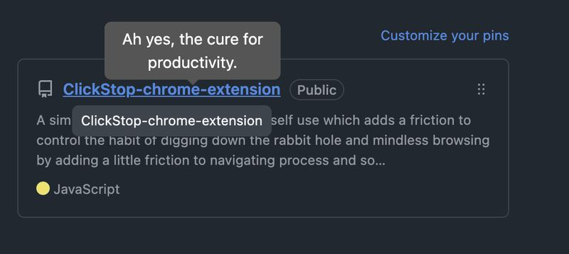
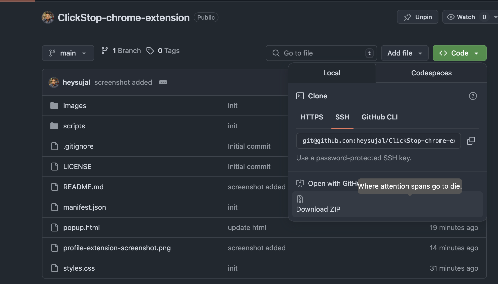

# ClickStop-chrome-extension

A simple chrome extension made for self use which adds a friction to control the habit of digging down the rabbit hole and mindless browsing by adding a little friction to navigating process and some mindful cues.

## Preview

## How to use?

1. Clone or Download and extract this repository.

2. Go to `chrome://extensions/` or similar for your browser.

3. Select `Load Unpacked` and upload the extracted or cloned repo.